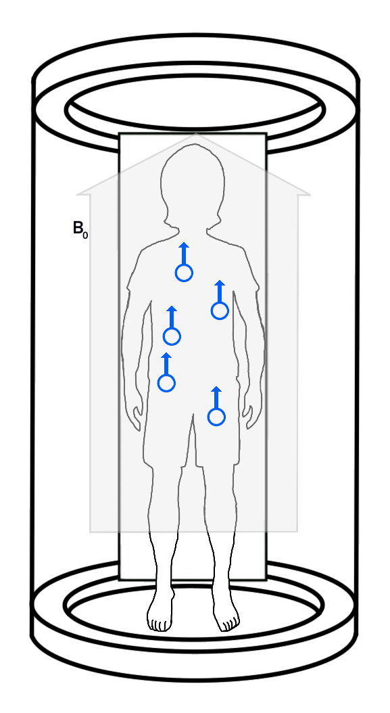
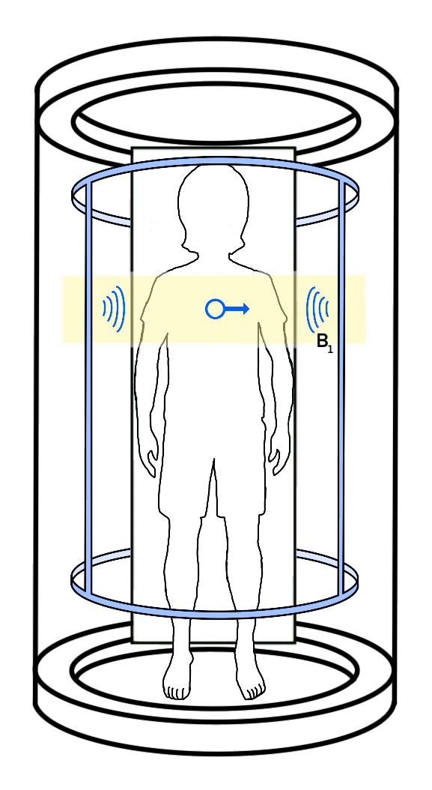

# MRI Concepts for Machine Learning

# Overview

This lecture includes basic and simplified concepts and explanations on how MRI Machines works, with the objective of deliver a context to machine learning engineers or any person for which document could be of use.

The terms and concepts are explained based in a research made from some sources listed at the end of this document, and my own understanding coming from a null knowledge in healthcare nor medical equipment.

Also the term and concepts were selected based in my own criteria and necessity to get the minimal high level understanding to work with MRI Images.

# MRI Functioning

## Key Component

**Hydrogen Nucleus**
- Our bodies are mainly composed by water, fat and proteins, where we can find hydrogen in their molecule structure.
- Hydrogen nucleus have the special characteristic that is only composed by 1 proton, 0 neutrons and 1 electron.

**Particle Spin**
- The spin is the magnetic momentum of a particle (proton, neutrons, electrons), which give a reference of its orientation.
- This spin give a notion of a north and south side.
- Due to the presence of the proton, the hydrogen nucleus have a spin of 1/2.

**Hydrogen Nucleus Spin**
- The net result of the spin of neutrons and protons corresponds to the spin of the atomic nucleus.
- In normal conditions, the hydrogen nucleus have different orientations around our body.

The hydrogen nucleus and their spin are the principal key on how these machines work.
From now on we will call $\color{orange}{\textsf{proton}}$ to the **hydrogen nucleus** to simplify the term. This is the naming convention that can be found in technical literatures.

## Main Magnet
- This generates the main magnetic field which cross the inside of the machine, and we can visualize this and its direction as the arrow $B_0$ (main magnetic field strength).
- The magnetic field forces the hydrogen nucleus spin to point to the same direction. 
- The **resonance frequency** of a proton in a magnetic field is given by the **Larmor equation**, which determines the direction of the spin. The **Larmor equation** is given by:
	**$w_o=\gamma*B$**
	$w_o$ : angular frequency (rad/s)
	$\gamma$ : gyromagnetic ratio (for ¹H ≈ 42.58 MHz/T)
	$B$ : local magnetic field strength (Tesla)
	As gamma is a constant the proton's orientation only depends on the local magnetic field.
	
- The majority of hydrogen nucleus are going to turn in the same direction as the magnetic field,  but others are going to point to the opposite, these are called anti proton.
- As the magnetic field generated by each proton is minimal, MRI works with the net amount.

## Gradient Coil
- The gradient coil determines the plane/view we are taken from the body.
- The gradient coil modifies the main magnetic field along the axis x, y or z, so it is slightly increased at one end and slightly decreased in the other.
- This gradient is achieved by applying a linear gradient along an axis (say z):
	**$B(z)=B_0​+G_z​⋅z$**
	$B_0​$ : main field strength
	$G_z​$ : gradient strength (T/m)
	$z$ : position along z-axis
	
- This gradient is applied only to one axis at a time, and the magnetic strength gradient determines the depth of each slice and the separation between them.
- So just by replacing, the resonance frequency of protons at position z becomes:
	$w(z)=\gamma (B_0​+G_z​⋅z)$

## RF (Radio Frequency) Coil

The RF Coil is seen as a two part component:
### RF Coil (transmitter)
- Is responsible of emitting a radio frequency pulse to change the spin of protons to a perpendicular orientation respect the main magnetic field.
- As the main magnetic field is not the same in all the axis, only the protons on a narrow range are going to flip to a perpendicular orientation respect $B_0$.
- This rf pulse have a bandwidth $\Delta w$, which is a narrow range of frequencies around $w_c$
- The flip angle equation is given by:
	$\theta =\gamma * B_1⋅\tau$
	$\tau$ : RF pulse duration
	$B_1$ : RF field strength
	So the RF pulse is only generated to create an oscillating ​field.

### RF Coil (receiver)
The receiver RF Coil can be a different one from the transmitter, as sometimes is used an external one specialized for some body parts.

After the pulse there are two spin movements of protons:

**T2 Relaxation - Perpendicular to the main magnetic field**
- After the pulse the spin is doing rounds under the z axis so it sends an irregular magnetic field to the receiver coil.
- When a magnetic field is induced in a coil it generates an electric charge, this is the data collected to generate the images after applying different techniques and algorithms.
- With time this movement in z reduces to 0, this lapse time is called T2 relaxation.
- The time is longer or shorter depending of the tissue where the proton is, in water there is more free movement than in fat, so in water T2 is longer.

**T1 Relaxation - Parallel to main magnetic field**
- In the absence of the the radio frequency pulse, the spin returns to be aligned to the main magnetic field.
- This time is also affected by the tissue where the proton, in fat this time will be shorter.

Actually these two movements happens at the same time, so the spin movement generates an spiral.
The different relaxation times gives the contrast we see in the images.

# MRI Image Planes

As mentioned before, the gradient coils applies a gradient to the main magnetic field over an specific axis, depending on the images we want to take.

The gradient coil is divided in 3 types:
- Gradient Coil Y
	- Applies a lineal gradient under the y axis.
	- Corresponds to the Coronal/Frontal Plane.
- Gradient Coil X
	- Applies a lineal gradient under the x axis.
	- Corresponds to the Sagittal Plane.
- Gradient Coil Z
	- Applies a lineal gradient under the z axis.
	- Corresponds to the Axial/Transversal Plane.

# MRI Image Types

We can basically classify the diversity of the images generated by the following:

- **Plane**
	As mentioned in the previous section basically there are 3 types of planes:
	- coronal/frontal
	- sagittal
	- axial/transversal
	Other views can be captured depending on the position of the patient and additional devices that can be added in the scan. Though this is determined by the pathology which is being searched for.

- **Relaxation Parameters**
	Offers different contrasts on data based on inherent characteristics of the tissue where protons are located.
	The most common relaxation parameters are T1 and T2, but also exists others like T2* and PD (Protonic Density).

- **Contrast Material Injection**
	For certain pathologies, is necessary to use contrast material which is injected into the patient. As protons behave differently depending on the medium they are, this material provides a different medium that allows to remark different zones in the scan, so is easiest to localize a pathology or to have a better understanding of the state.

# Sources

Westbrook, C. & Talbot, J. (2019).  MRI IN PRACTICE. WILEY Blackwell.

Nel, Michael. \[[Radiology Tutorials](https://www.youtube.com/@radiologytutorials)] (2025-09-16)  MRI physics course \[Video Playlist] 
YouTube. https://www.youtube.com/playlist?list=PLWfaNqiSdtzVp5u79H_sFE4IPcjgwhKdQ

[thePIRL](https://www.youtube.com/@thepirl903) (2025-09-16) How MRI Works \[Video Playlist]
YouTube. https://www.youtube.com/playlist?list=PLkSVzqeK5v2C4X1G3IuRUQeNveNGNxZrn

