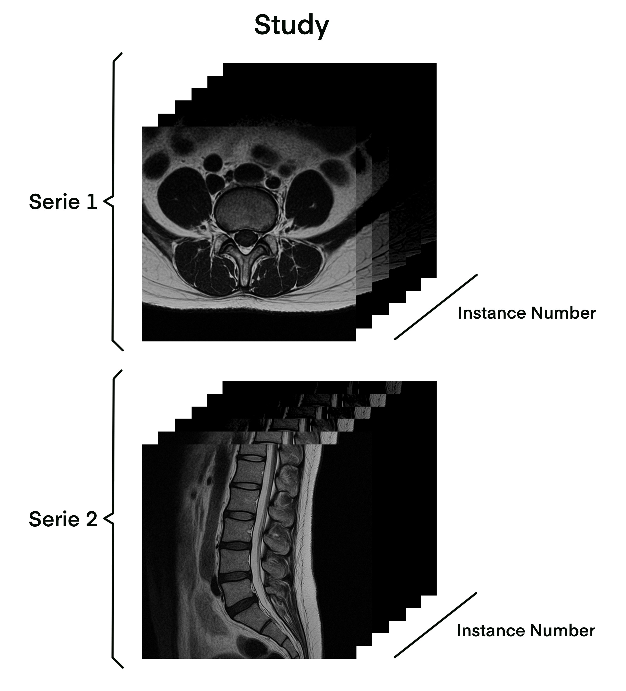
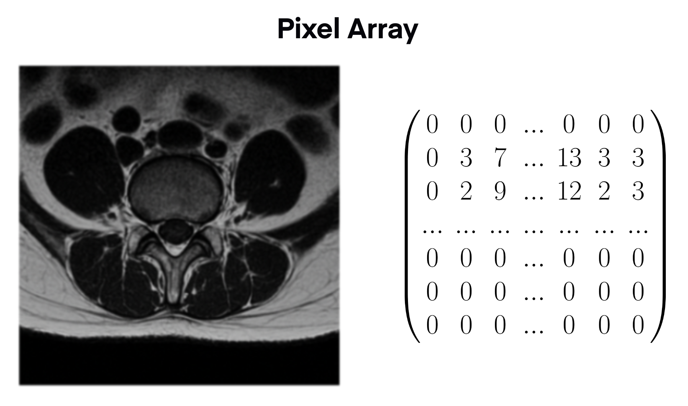

# Pydicom Library

# 01 MRI File
## 01.01 MRI File Hierarchy 

The data generated of the scan have a basic structure, which is also reflect on the file directory structure.

- **Study**
	This corresponds to the complete scan session done to the patient. If the same patient have a new scan any other day, this is stored as new study. The **study_id** identifier is assigned to the study to allow a better identification, also is common to assign this identifier as the name for the folder.

- **Series**
	Refers to one scan in the same study, so we can have many different series in the same study. An example of this can be seen in the image below, as the plane determines a new series, but also the relaxation parameters (T1, T2, ...). Also the identifier **series_id** is assigned to each series and is commonly used to name the file folder of the series.

- **Instance number**
	he body is scanned in slices which later on are stacked to complete the full representation of the body. Each slice is stored as a file and identification number called **instance_number** is assigned to each to also stablish a sequence.

|  |  |
| ------------------------------------------------------------------------------------------------ | ------------------------------------------------------------------------------------------ |

## 01.02 MRI Metadata

Each MRI file is composed of metadata which are attributes used to have the complete information of the scan in the 3D space of the study.
There are several attributes but in the following list I explain the basic ones used in machine learning.

| Metadata                                                                                                                                                                                                                                                                                                                                                                                                                                                                         | Visual Representation                                                                                |
| -------------------------------------------------------------------------------------------------------------------------------------------------------------------------------------------------------------------------------------------------------------------------------------------------------------------------------------------------------------------------------------------------------------------------------------------------------------------------------- | ---------------------------------------------------------------------------------------------------- |
| **Study Instance UID**<br><br>Known as Study ID, corresponds to the identifier assigned to the complete scan session done to the patient.<br>                                                                                                                                                                                                                                                                                                                                    | 4003253                                                                                              |
| **Series Instance UID**<br><br>Known as Series ID, corresponds to the identifier assigned to the 3D scan made under a unique combination of parameters. For example the scan done of the axial view can be 1 series.                                                                                                                                                                                                                                                             | 4003253.702807833                                                                                    |
| **Instance Number**<br><br>Identifier assigned to one slice of a scan, so it determines the sequence of images in which the stack has to be ordered to complete the 3D image.                                                                                                                                                                                                                                                                                                    |      |
| **Series Description**<br><br>Refers to the **relaxation parameter** which is a classification for a complete series. This classifies the contrasts of the images applied to visually remark the different pathologies.                                                                                                                                                                                                                                                          | T1, T2, ...                                                                                          |
| **Pixel Array**<br><br>Corresponds to the matrixial representation of the slice image. Used to generate the image and to feed our model after some preprocessing methods.                                                                                                                                                                                                                                                                                                        |                |
| **Image Position Patient**<br><br>This attribute is the coordinate of the middle point of the top left pixel respect the 3D space of the scan (respect to 1 series). So, this coordinate give us the space location of our slice.<br>                                                                                                                                                                                                                                            |     |
| **Image Orientation Patient**<br><br>This attribute has 2 orthogonal basis vectors of the 3D space of the scan (respect to 1 series). With those 2 vectors we can transform any point in the image to a coordinate in the 3D space.<br><br>The value in this attribute stores both basis vectors $\color{red}{\textsf{V1}}$ and $\color{green}{\textsf{V2}}$, one after the other like this:<br>\[$\color{red}{\textsf{v1x,v1y,v1z}}$,$\color{green}{\textsf{v2x,v2y,v2z}}$]<br> |  |
| **Spacing Between Slices**<br><br>Corresponds to the space between the image slices in mm.                                                                                                                                                                                                                                                                                                                                                                                       |                                                                                                      |


## 01.03 DICOM Dictionary
A full list of the metadata can be found on the following page with a description.
https://dicom.innolitics.com/ciods


# 02 Pdycom Functions

## 02.01 Package Installation and Module Import


```shell
pip install --no-cache-dir pydicom
```


```python
import pydicom
```


## 02.02 Load DCM files

As mentioned in section '01.01 MRI File Hierarchy', DCM files are stores in a hierarchical directory based in study_id and series_id.

```python
ds = pydicom.dcmread('./base_path/study_id/series_id/instance_number.dcm')
```


## 02.03 Metadata

### Show full metadata list
This command lists all the metadata attributes with their respected value.
```python
print(ds)
```

The elements are grouped in two, as shown in the image below. The first group of elements corresponds to file information, and the second to the data of the scan.


### Show metadata elements
To retrieve an attribute value you only need to use the name without spaces.
```python
print(ds['PatientID']) #(0010,0020) Patient ID LO: '4003253'
print(ds.data_element('PatientID')) #(0010,0020) Patient ID LO: '4003253'
print(ds.BitsAllocated) #4003253
```

Also is possible to access the elements by using the following code, but is only restricted to elements related to the data of the scan, not the file.

```python
ds[0x0008, 0x0018] #(0008,0018) SOP Instance UID UI: 4003253.1.8
```

```python
element = ds.get((0x0008, 0x0018))
print(element) #(0008,0018) SOP Instance UID UI: 4003253.1.8
print(element.keyword) #SOPInstanceUID
print(element.value) #4003253.1.8
```


### Get Image Array
The image array is also a metadata attribute and can be extract with the command:
```python
ds.pixel_array

'''
array([
[ 0, 0, 0, ..., 0, 0, 0], 
[ 0, 3, 7, ..., 13, 3, 3],
[ 0, 2, 9, ..., 12, 2, 3], 
..., 
[ 0, 0, 0, ..., 0, 0, 0], 
[ 0, 0, 0, ..., 0, 0, 0], 
[ 0, 0, 0, ..., 0, 0, 0]], dtype=uint16)
'''
```

## 02.04 Modify
We can change the element values by using the following code:
```python
#Load the element
element = ds.get((0x0008, 0x0018))
print(element.value) #4003253.1.8

#Change element value
element.value = '4003253.1.9'

#Check changed value
print(element.value) #4003253.1.9
```

## 02.05 Delete
To delete elements from the file we use:
```python
print(ds['PatientID']) #(0008,0018) SOP Instance UID UI: 4003253.1.8
del ds.SOPInstanceUID
```


## 02.06 Save File
If we want to save the changes we can do this by using the code:

```python
ds.save_as('outfile_name.dcm')
```


# 03 Anonymizing Data

In healthcare we have to be cautious to avoid using sensitive data that could infringe any legal norm. This is a list of some elements that we should potentially remove from our dataset.
- PatientsName
- PatientBirthDate
- PatientsSex
- OtherPatientNames
- EthnicGroup
- ResponsiblePerson

Also, in Machine Learning we have to avoid using data that could generate a bias to our prediction. So we have to understand the problem, and the data we have to filter the elements that could have a negative impact in our models.

With the following code we can remove all the sensitive elements:

```python
keywords = [
	'PatientsName',
	'PatientBirthDate',
	'PatientsSex',
	'OtherPatientNames',
	'EthnicGroup',
	'ResponsiblePerson'
]

for keyword in keywords:
	if keyword in ds:
		del ds.data_element(keyword)
```


# 04 Image Visualization

### 04.01 Show Single Image

```python
import matplotlib.pyplot as plt

plt.imshow(ds.pixel_array, cmap='gray')
```


### 04.02 Show Series Images

```python
import matplotlib.pyplot as plt
import math

def show_series_images(path:str, study_id:str, series_id:str):
    series_path = os.path.join(path, study_id, series_id)
    files = os.listdir(series_path)    
    files = sorted(files, key=lambda x:int(x[:-4]))

    ncols=4
    nrows = math.ceil(len(files) / ncols)
    
    fig, ax = plt.subplots(nrows=nrows, ncols=ncols, figsize=(15,15))
    
    for idx, img in enumerate(files):
        ds = pydicom.dcmread(os.path.join(series_path, img))
        row_idx = idx // ncols
        col_idx = idx % ncols
        ax[row_idx,col_idx].imshow(ds.pixel_array, cmap='gray')
        ax[row_idx,col_idx].set_title(f'Instance Number {ds.InstanceNumber}')
    
    #Removes Empty subplots
    empty_subplots = ncols - len(files) % ncols
    for col_idx in range(empty_subplots):
        ax[nrows -1, ncols -1 -col_idx].axis("off")
```


```python
show_series_images(path='./train_images',study_id='4003253',series_id='702807833')
```


# 05 File Processing Techniques

## 05.01 MRI Image Process Options

When working with this images with machine learning, there are different possibilities that we could choose depending on the problem is being tried to solve.

### 05.01.01 2D slice processing
As in common computer vision image classification problems, we can process the scan images as individuality in its matrixial representation.

This option consumes less GPU but losses features about the context.


#### Dataset Example
For a csv with labels like:

| id  | study_id | series_id | instance_number | label  |
| --- | -------- | --------- | --------------- | ------ |
| 0   | 21343    | 35432     | 1               | Severe |

We can work with this template dataset
```python
class MRIDataset2D(Dataset):
    def __init__(self, df:pd.DataFrame, img_dir:str, labels=True, transform=None):
        
        self.img_dir = img_dir
        self.labels = labels        
        self.transform = transform
        self.data = df

    def __len__(self):
        return len(self.data)
    
    def __getitem__(self, idx):
        '''
        For the requested id retrieves the sample with their respective label
        '''
        
        #Extract Image Data -------------------------------------------------
        row = self.data.iloc[idx]
        
        if self.labels:
            study_id, series_id = row['study_id'], row['series_id'] 
            inst_number = row['instance_number']
            
            image_array, inst_numbers, slice_dict = self.load_image(
											            study_id,
											            series_id,
											            inst_number)
            label = row['label']
        else:
            study_id, series_id = row['study_id'], row['series_id']
            image_array, inst_numbers, slice_dict = self.load_image(
											            study_id,
											            series_id,
											            inst_number)
            label = None
             
        #Preprocessing logic ------------------------------------------------
        if self.transform:
            pass
             
        #Label Encodeing ----------------------------------------------------
        if self.labels:
            label_idx = self.class_idx_map[label]
            label_tensor = torch.tensor(label_idx).clone().detach().long()
        else:
            label_tensor = torch.tensor(-1).clone().detach().long()
            
        return image_array, label_tensor

        
    def load_image(self, study_id:int,series_id:int,inst_number:int):
        '''
        Retrieves the image array of the DCM file
        '''
        fname = str(inst_number) + '.dcm'
        fpath = os.path.join(self.img_dir,str(study_id),str(series_id),fname)
        ds = pydicom.dcmread(fpath)
        
        slice_dict = {
            'fpath':fpath,
            'fname':fname,
            'ds':ds,
            'instance_number':ds.InstanceNumber,
            'pixel_array':ds.pixel_array,
            'ipp':ds.ImagePositionPatient,
            'iop':ds.ImageOrientationPatient,
            'spacing':ds.SpacingBetweenSlices
        }
        
        inst_number = slice_dict['instance_number']
        image_array = slice_dict['pixel_array']
        
        return image_array, inst_number, slice_dict

    
    def generate_class_idx_map(self):
        '''Generates the map for the labels'''
        
        if self.labels:
            #Create a list with all the classes
            classes = self.data['label'].unique()
            
            #Create an index mapping for each label
            self.class_idx_map = {cls:idx for idx, cls in enumerate(classes)}
    
    def set_class_idx_map(self, class_idx_map):
        '''
        Sets the map of label instead of generate them.
        Used for validation/test/prod
        '''
        self.class_idx_map = class_idx_map
    
    def get_class_idx_map(self):
        '''Retrieves the label mapping'''
        return self.class_idx_map

```

### 05.01.02 3D volume processing
Is possible to stack the images to work with the volumetric representation. Like this we will work with the stack of arrays as a tensor.

This is more GPU demanding but preserve more information.


#### Dataset Example
For a csv with labels like:

| id  | study_id | series_id | label  |
| :-- | :------- | --------- | ------ |
| 0   | 21343    | 35432     | Severe |

```python
class MRIDataset3D(Dataset):
    def __init__(self, df:pd.DataFrame, img_dir:str, labels=True, transform=None):
        self.data = df
        self.img_dir = img_dir
        self.labels = labels        
        self.transform = transform
        
    def __len__(self):
        return len(self.data)
    
    def __getitem__(self, idx):
        '''
        For the requested id retrieves the sample with their respective label
        '''
        
        #Extract Image Data -------------------------------------------------
        row = self.data.iloc[idx]
        
        if self.labels:
            study_id, series_id = row['study_id'], row['series_id']
            vol, inst_numbers, slices = self.load_series_slices(study_id,series_id)
            label = row['label']
        else:
            study_id, series_id = row['study_id'], row['series_id']
            vol, inst_numbers, slices = self.load_series_slices(study_id,series_id)
            label = None
             
        #Preprocessing logic ------------------------------------------------
        if self.transform:
            target_size = (16,224,224) # (depth,heigth,width)
            
            #Adjust Dimension
            tensor = torch.from_numpy(vol).float()
            tensor = tensor.unsqueeze(0).unsqueeze(0)
            vol = F.interpolate(
	            tensor, 
	            size=target_size, 
	            mode='trilinear',
	            align_corners=False
            ).squeeze(0)   
        
        #Label Encodeing -----------------------------------------------------
        if self.labels:
            label_idx = self.class_idx_map[label]
            label_tensor = torch.tensor(label_idx).clone().detach().long()
        else:
            label_tensor = torch.tensor(-1).clone().detach().long()
            
        return vol, label_tensor
        
  
    def load_series_slices(self, study_id:int,series_id:int):
        '''
        Forms a stack with the dcm files from one serie_id
        '''
        series_path = os.path.join(self.img_dir,str(study_id),str(series_id))
        
        dcm_files = [f for f in os.listdir(series_path) if f.endswith('.dcm')]
        
        slices=[]
        for fname in dcm_files:
            fpath = os.path.join(series_path,fname)
            ds = pydicom.dcmread(fpath)
            slice = {
                'fpath':fpath,
                'fname':fname,
                'ds':ds,
                'instance_number':ds.InstanceNumber,
                'pixel_array':ds.pixel_array,
                'ipp':ds.ImagePositionPatient,
                'iop':ds.ImageOrientationPatient,
                'spacing':ds.SpacingBetweenSlices
            }
            
            slices.append(slice)
        
        def slice_sort(item):
            return item['instance_number']
        
        slices.sort(key=slice_sort)
        
        vol = np.stack([slice['pixel_array'] for slice in slices],axis=0)
        inst_numbers = [slice['instance_number'] for slice in slices]
        
        return vol, inst_numbers, slices

    
    def generate_class_idx_map(self):
        '''Generates the map for the labels'''
        
        if self.labels:
            #Create a list with all the classes
            classes = self.data['label'].unique()
            
            #Create an index mapping for each label
            self.class_idx_map = {cls:idx for idx, cls in enumerate(classes)}
    
    def set_class_idx_map(self, class_idx_map):
        '''
        Sets the map of label instead of generate them.
        Used for validation/test/prod
        '''
        self.class_idx_map = class_idx_map
        
    def get_class_idx_map(self):
        '''Retrieves the label mapping'''
        return self.class_idx_map
```

### 05.01.03 2.5D arrangement
Any variance respect to the 3D volume processing is called 2.5D, as some information is not considered.

In the image below, are selected only the most relevant slices so we do not have the complete volume, but by doing this we are reducing noise. Also, the axial view is included to add more information. This changes are made to achieve a better balance between GPU demand and information preservation.


